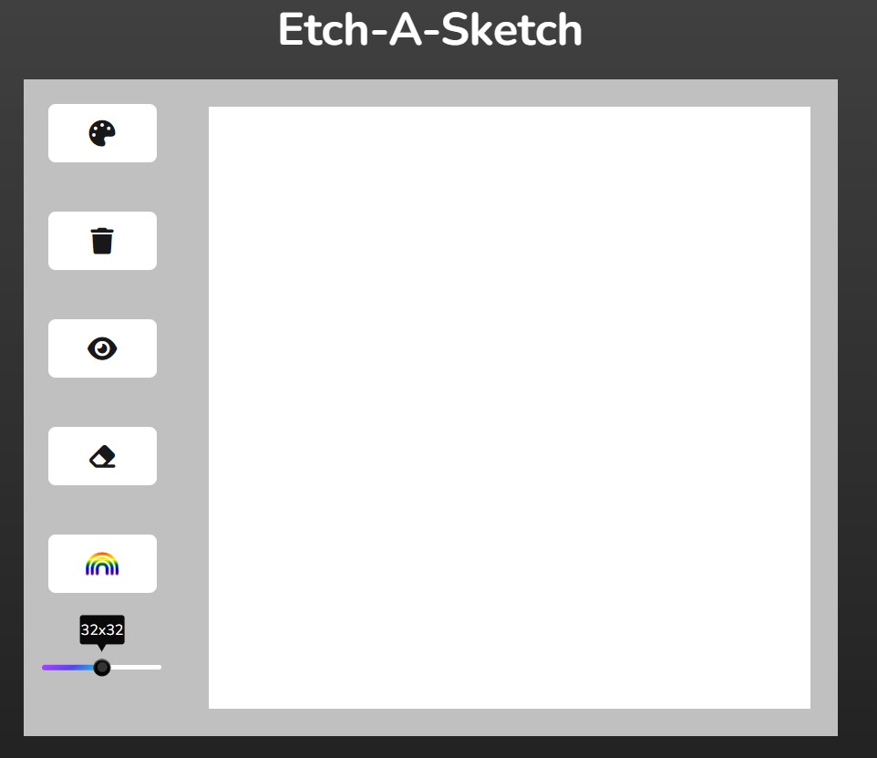

# Etch-A-Sketch
This is a simple web application that allows users to draw on a grid using their mouse. User can also select multiple drawing options such as erasing and random colors.

## Usage 
The application automatically generates a 32x32 grid upon loading. Users can draw on the grid by clicking and dragging their mouse across the squares.

## Options
* Eraser: Users can toggle between drawing with the pen or erasing by clicking on the "Eraser" button.
* Random Colors: Users can toggle between drawing with black or random colors by clicking on the "Random Color" button.
* Clear Grid: Users can clear the grid by clicking on the "Clear Grid" button.
* Change Grid Size: Users can change the size of the grid by using the slider located at the top of the page. Simply slide the marker to the desired size and the grid will automatically update.

## Limitations 
* The application is optimized for desktop use only.
*  Grid size is limited to 64x64 due to performance issues.

## Contributing 
If you would like to contribute to this project, please fork the repository and submit a pull request with your changes.